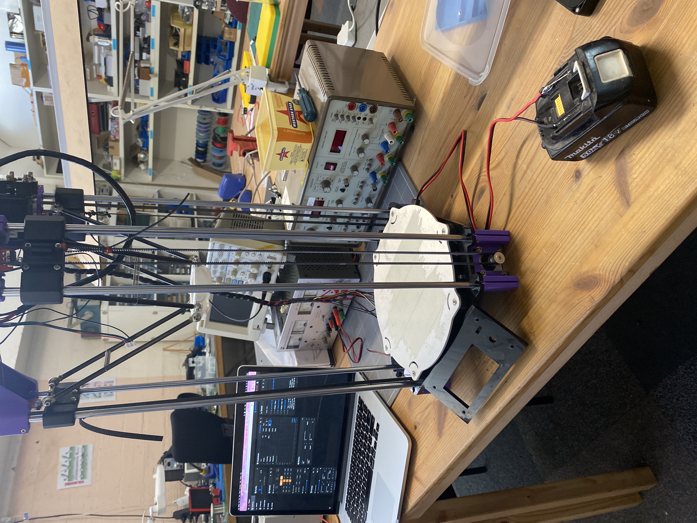
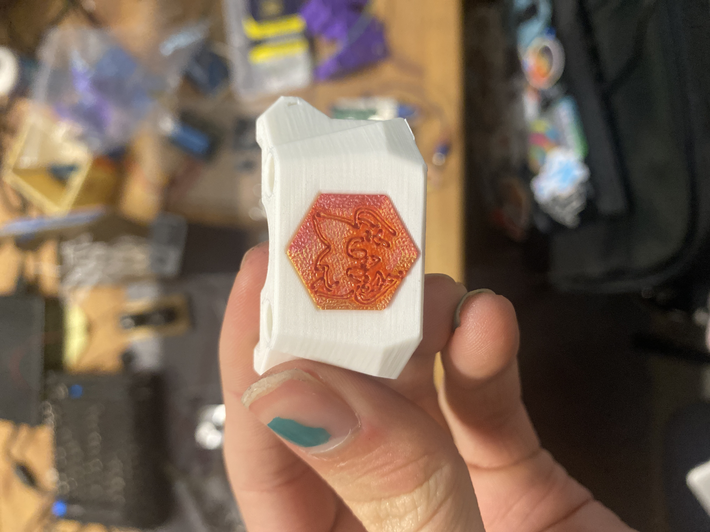
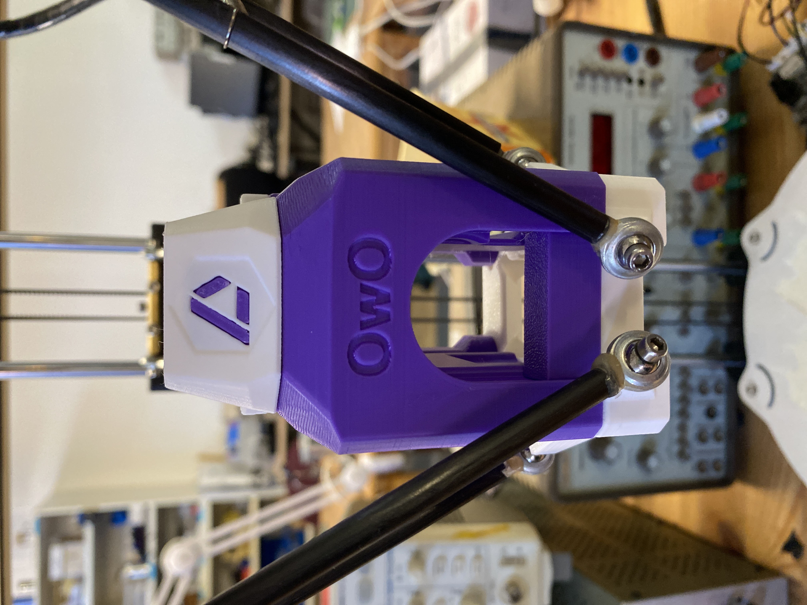
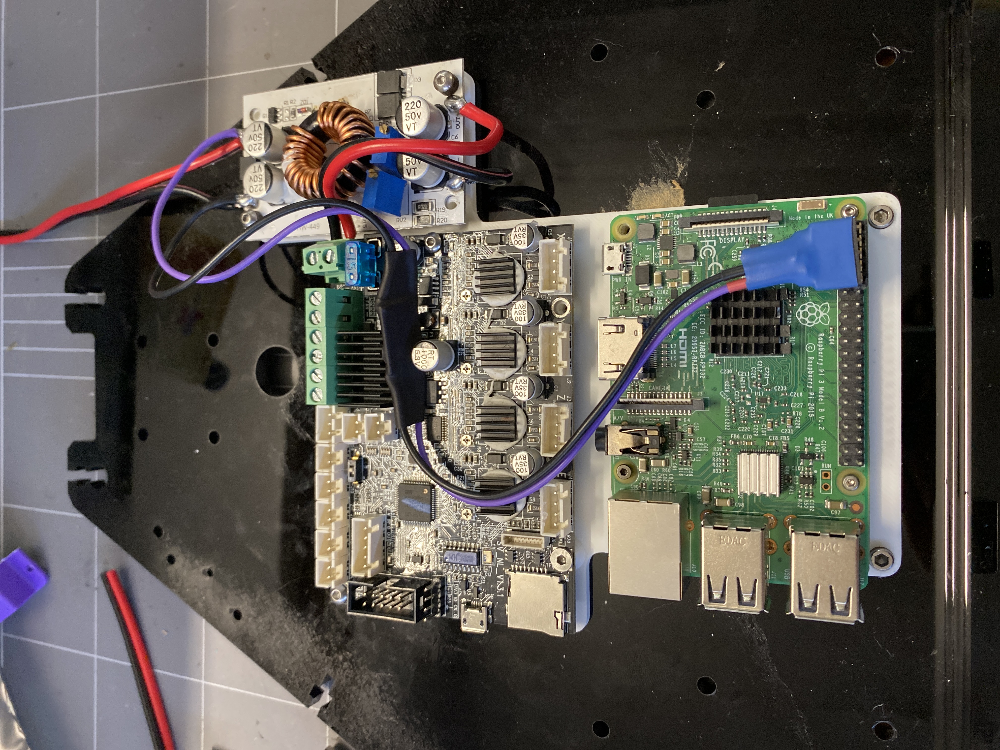
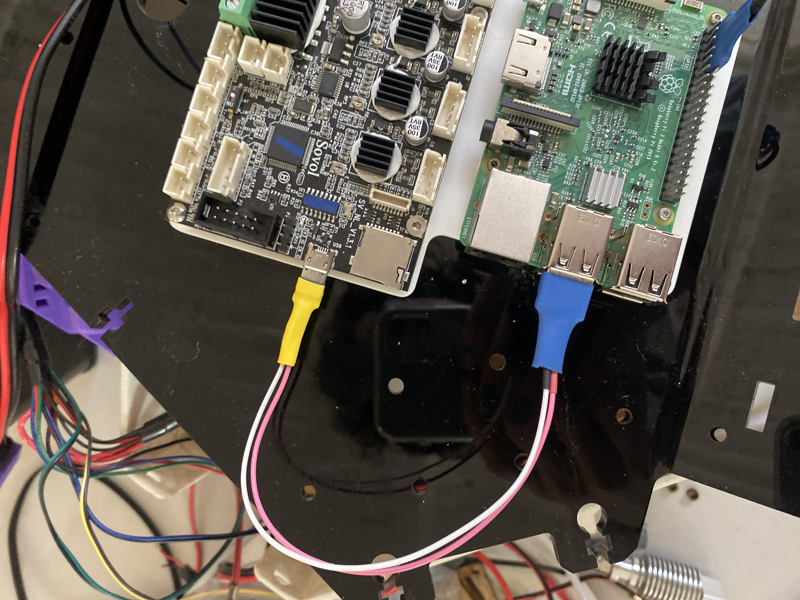

This is just a remake of a 2017 Jaycar kit delta but its not really because ive had to remake basically the entire thing and its now running klipper 

i'll slowly be adding bits and bobs to this as I work on this project

THIS IS NOT A KIT OR A GUIDE, if you do choose to print parts from this print all parts from ABS at the voron printing spec and cut the acrylic sheets from 6mm thick acrylic (or metal? idk how thatd work)

Credit to Chirpy for the [Cranefly](https://github.com/chirpy2605/voron/tree/main/general/CraneFly) toolhead which I slightly modified to fit the Mellow3D ALPS heatcore hotend and ABL probe and also thanks to bassamanator for the [basic configs](https://github.com/bassamanator/Sovol-SV06-firmware) that i used and also for the calibration and macros files too

Most of the cad was made in a few hours late at night so the fusion files are a real mess but should be workable if you need any parts for your TL4100

I will be adding all my klipper configs and orca profiles as I make them but dont expect them to be pretty

